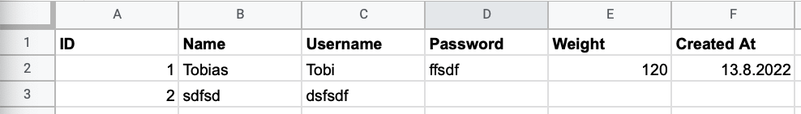

# googlesheetsparser

googlesheetsparser is a library for dynamically parsing Google Sheets into Golang structs.

## Installation

```bash
go get github.com/Tobi696/google-sheets-parser
```

### Requirements

This library requires Go >= 1.18 as generics are used.

## Usage


The Image shows the sheet called "Users" which is contained int the example spreadsheet.  

To Parse it, we would utilize following code:

```go
type User struct {
	ID        uint // <- By default, columns will be parsed into the equally named struct fields.
	Username  string
	Name      string
	Password  *string
	Weight    *uint
	CreatedAt *time.Time `sheets:"Created At"` // <- Custom Column Name, optional, will be prioritized over the Struct Field Name
}


// Acutal usage of the Library
users, err := googlesheetsparser.ParsePageIntoStructSlice[User](googlesheetsparser.Options{
    Service:       srv, // <- Google Sheets Service (*sheets.Service)
    SpreadsheetID: "15PTbwnLdGJXb4kgLVVBtZ7HbK3QEj-olOxsY7XTzvCc",
    // SheetName: "app-user", <- Optional, by default the library will pluralize the struct name provided as generic, e.g. User -> Users
    DatetimeFormats: []string{ // <- Optional, here you can provide further Datetime Formats
        "2.1.2006",
        "02.01.2006",
        "02.01.2006 15:04:05",
    },
}.Build()) // <- Don't forget to call Build() on the Options struct you provide
if err != nil {
    log.Fatalf("Unable to parse page: %v", err)
}

// Do anything you want with the result
fmt.Println(users)
```


### Authenticating a Google Sheets Service

There are different ways to authenticate a Google Sheets Service.

Please refer to the [Google Sheets Go Quickstart](https://developers.google.com/sheets/api/quickstart/go) for more information.


### Example

To try out the example yourself, check out the [example/](emaple/)-Directory.


## Intention

This library is intended to be used as a library for parsing Google Sheets into Golang structs. It is not intended to be used as a library for generating Google Sheets from Golang structs.  

The initial need that this library was created for is for seeding a database with data from a Google Sheets.  
That's very useful because often people who don't have the knowledge to work directly on Databases want to seed their Applications (Mobile/Desktop or whatever) with data. With this library, these people can enter their seed data into a Google sheet and the Developer seed the Database with the structs that the library parsed for him.


## Future

In the future, this library will be extended with test cases to ensure that the library is working as expected.

When the library has reached a reasonable test coverage, it will be extended to support more types, flexible sheets and other things users would like to see.


## Contributing

Contributions are welcome! Please open an issue or pull request if you have any suggestions or want to contribute.